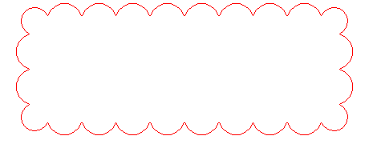

# Плагин для JavaScript библиотеки leaflet

1. Для toolbar в leaflet добавить возможность рисовать элементы на карте как показано на рисунке.
2. Результат должен быть оформлен в виде проекта на GitHub.

